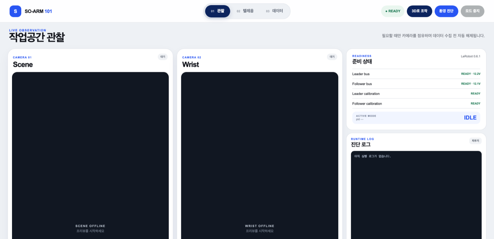
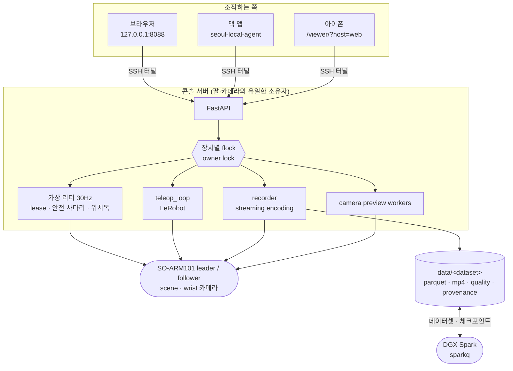
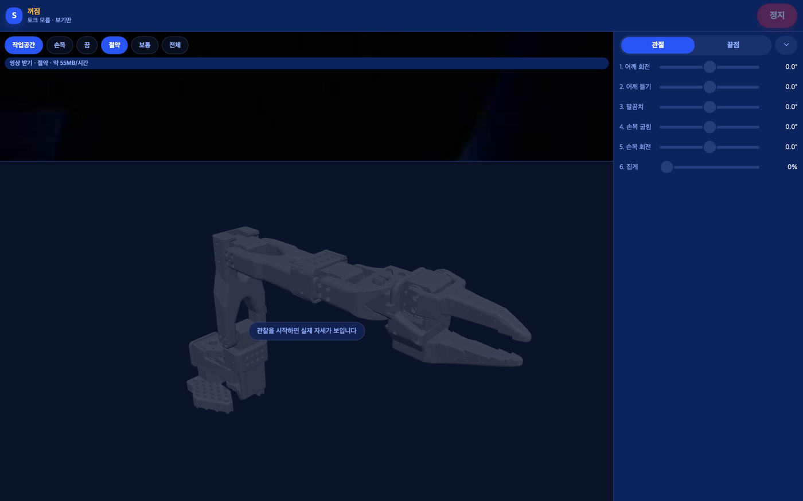
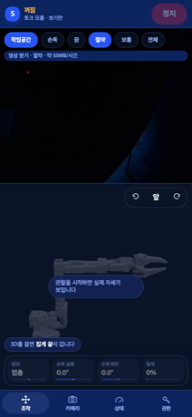

# SO-ARM101 Console — 팔·카메라·데이터셋의 단일 소유자

SO-ARM101 leader–follower 팔을 위한 로컬 우선 운영 콘솔임. 브라우저 하나에서 하드웨어 상태
확인, 캘리브레이션, 안전 게이트가 있는 텔레옵, LeRobot 호환 데이터 수집, 학습 서버로의 전송까지
함. **물리 리더 팔 없이** 3D로 그린 팔을 맥이나 아이폰에서 끌어 조작하는 가상 리더 경로가 따로
있고, 그 목표값은 서버의 안전 사다리를 통과해야 모터에 닿음.

> *A local-first operations console for a SO-ARM101 leader–follower arm: hardware doctor,
> calibration, gated teleoperation, LeRobot-compatible recording, and dataset/checkpoint transfer to
> a training server — all from one browser page. A virtual-leader path lets a Mac or iPhone drag a
> 3D arm instead of a physical leader; every goal has to clear a server-side safety ladder before it
> reaches a motor. Python 9.8k lines, 251 tests. Documentation is in Korean.*



<sub><b>콘솔</b> — 관찰 · 텔레옵 · 데이터 세 화면. 오른쪽 `준비 상태`가 시작을 막는 것이 무엇인지
(모터 응답 · 전압 · calibration) 이름으로 말함.</sub>

---

## 무엇을 하는가

| 단계 | 내용 |
|---|---|
| **진단** | 모터 ID·모델·firmware·위치·전압·토크 상태만 읽음. motion command는 보내지 않음 |
| **캘리브레이션** | 양팔 각각. calibration JSON의 `sha256`이 데이터셋의 provenance에 함께 남음 |
| **텔레옵** | 물리 리더 → 팔로워(30 FPS, 틱당 2° 상한) 또는 **가상 리더**(3D 화면 → 팔로워) |
| **데이터 수집** | 로컬 LeRobot 데이터셋. 회차 조기 종료·재촬영·저장·**버리기** 네 조작, 이어 찍기, 회차 삭제 |
| **재생** | 찍은 회차를 팔에 다시 흘려 봄. 첫 프레임으로 뛰지 않고 걸어서 감 |
| **학습 연동** | 데이터셋을 DGX Spark로 보내고, 원격 tmux에서 학습을 띄우고, 체크포인트를 되받음 |

## 시스템 구조



콘솔은 기본적으로 `127.0.0.1`에만 bind함. 인증 없는 motion-control API를 LAN에 노출하지 않으며,
원격 접속은 SSH 터널을 씀 — **신뢰 경계는 그 터널이다.**

`/api/status`의 `capabilities`가 이 서버가 답할 수 있는 것들의 이름을 실음 — `abort`, `resume`,
`preview`, `quality`, `delete`, `train`, `replay_preview`, `soft_start`, `sensor_extras`. 맥 앱은
이 목록에 이름이 있을 때만 해당 기능을 켬. 화면이 서버보다 앞서 나가면 사람은 눌리지 않는 단추를
보게 되고, 서버가 앞서 나가면 새 기능이 아무에게도 보이지 않기 때문임.

## 설계에서 신경 쓴 부분

- **장치의 소유자는 언제나 하나임.** observation·teleop·recording·가상 리더 경로가 장치별
  `flock`으로 serial bus와 카메라를 배타 점유함. 같은 팔에 두 곳에서 명령이 들어가는 것이 이
  시스템에서 가장 나쁜 실패이기 때문임. lock을 무시하는 외부 프로세스까지 OS가 막아 주지는
  않으므로 그 한계도 함께 적어 둠. [ADR 0003](ADR/0003-device-owner-lock.md)
- **게이트가 사고의 원인이 되고 있었음.** 예전에는 시작 전에 "토크가 걸려 있지 않은가"를
  물었는데, 텔레옵과 수집은 팔이 떨어지지 않도록 토크를 켠 채 끝나므로 **정상적으로 끝낸 세션
  다음의 시작이 반드시 거절되었음.** 사람은 그때마다 토크를 풀었고, 팔은 처졌고, 다음 시작에서
  그만큼 튀었음. 지금 시작을 막는 것은 모터가 답하지 않거나 전압이 범위 밖일 때뿐이고, "다른
  프로세스가 이미 팔을 쥐고 있는가"는 `flock`이 답함. 안전 장치가 사람에게 위험한 우회를 시키면
  그것은 안전 장치가 아니기 때문임(2026-09-05).
- **시작할 때 팔이 튀지 않게 함.** 두 자리를 고쳤음. 붙는 순간에는 토크가 켜지기 전에
  `Goal_Position`을 지금 자세로 옮김 — STS3215는 토크가 걸리는 순간 남아 있던 옛 목표를 향해
  최고 속도로 가기 때문임. 루프에 들어가기 전에는 팔로워를 리더의 **지금** 자세까지 s-curve로
  걸어감(첨두 40°/s, 집게 50%/s, 1–6초) — LeRobot의 첫 틱은 리더 자세를 그대로 보내므로 두 팔이
  다르면 팔로워가 그 차이만큼 한 번에 뛰기 때문임.
- **물리 리더가 없어도 조작할 수 있게 하되, 권한은 하나만 줌.** 3D로 그린 팔을 끌면 목표값이
  30Hz로 들어옴. 그 값은 절대 관절 한계 → 틱당 변화량 → 자세 동기화 → 부하·전류·추종오차·온도 →
  워치독 순서로 검사되고, 조작 권한(lease)은 한 시점에 한 기기만 가짐. 원격 조작에서 가장 흔한
  사고는 "누가 지금 이 팔을 움직이고 있는지 모르는 것"이기 때문임. [ADR 0002](ADR/0002-virtual-leader-owner.md)

  

  <sub>맥·브라우저에서 여는 같은 화면. `관절`과 `끝점`(역기구학) 두 조작 방식이 있고, 오른쪽
  값은 서버가 되읽어 주는 실제 자세임. 권한을 받기 전에는 보기만 함.</sub>

- **폰에서는 화면을 줄이는 대신 조작 방식을 줄였음.** 관절 슬라이더 여섯 줄은 393×852 화면에서
  267px을 가져가 카메라를 92px짜리 띠로 눌렀음. 그래서 폰에서는 조작 방식이 `끝점` 하나이고 아래
  조작판이 없음. 사람이 직접 정하는 넷(앞뒤·손목 굽힘·손목 회전·집게)은 3D 위에 뜨는 타일 넷이
  맡고, 넷 다 누른 채 좌우로 끄는 같은 몸짓임. 그 결과 카메라는 294px(폭에 정확히 4:3이라
  640×480이 잘리지 않는다), 3D는 392px을 씀. **원격으로 팔을 움직이는 사람에게 가장 필요한 것은
  슬라이더가 아니라 팔이 무엇을 하는지 보이는 화면이기 때문임.**

  <table>
  <tr>
  <td width="34%"></td>
  <td width="66%" valign="top"><sub>카메라 294px · 3D 392px. 3D 위에 뜬 타일 넷(<b>앞뒤 · 손목
  굽힘 · 손목 회전 · 집게</b>)이 관절 슬라이더 여섯 줄을 대신하고, 넷 다 누른 채 좌우로 끄는 같은
  몸짓임. 아래 탭 넷(조작 · 카메라 · 상태 · 권한) 어디에서도 <b>정지</b>가 늘 보임. 위쪽
  <code>절약 · 약 55MB/시간</code>은 서버에 거는 카메라 프로필이라, 받는 쪽에서 프레임을 버리는
  것이 아니라 실제로 덜 찍고 덜 보냄.</sub></td>
  </tr>
  </table>

- **찍다 만 회를 온전한 시연인 척 남기지 않음.** 수집 조작은 넷임 — `right`(조기 종료),
  `left`(재촬영), `esc`(저장하고 끝), **`abort`(찍던 회를 버리고 끝)**. `esc`는 루프를 빠져나온 뒤
  `save_episode()`가 그대로 돌아 찍다 만 회를 저장하는데, 실제로 82프레임 2.7초짜리 조각이 남은
  적이 있어 `abort`를 따로 두었음. 회 사이에 누른 키를 버리는 이유와 그때 잃은 여덟 회 이야기는
  [DATASET.md](DATASET.md)에 있음.
- **화면이 침묵하지 않게 함.** 회차 사이 정리와 저장(인코딩) 구간이 각각
  `phase=resetting`·`saving`으로 나가고, 저장된 회차 수는 `episodes_saved`로 실림. 정리 15초 뒤
  인코딩 8초 동안 화면이 아무 말도 하지 않아 사람이 수집이 죽은 줄 알던 자리이기 때문임. 수집
  중에는 카메라를 record 자식이 쥐고 있으므로 찍는 쪽이 보는 프레임을 5Hz로
  `/api/recording/preview/{scene|wrist}.jpg`에 내려놓되, **3초보다 오래된 그림은 404임** — 멈춘
  카메라의 마지막 장면을 계속 보여 주면 화면은 아무 일도 없다는 듯 그것을 보여 주기 때문임.
- **서보가 내주는 값을 전부, 원본 그대로 남김.** 수집이 매 프레임(30Hz) 위치 말고도
  부하·속도·온도·전압·상태 바이트·이동 플래그·전류와, 그 프레임을 읽은 시각, 카메라별 새 프레임
  여부, 그리고 **그 프레임의 서보 읽기가 실제로 성공했는지**를 별도 열로 남김. 어떤 열에도
  clamp·대체·보간이 없음 — 목적이 나중에 모터 부하로 간접 촉각을 추정하는 것이고, 시연은 다시
  찍을 수 없기 때문임. `observation.state`는 관절 위치 여섯 그대로 두므로 지금까지 학습한 정책과
  사전학습 정규화 통계는 그대로임. [DATASET.md](DATASET.md)
- **학습은 콘솔이 띄우되 품지 않음.** `POST /api/spark/train`이 원격 tmux 세션 `train-<run>` 안에서
  `lerobot-train`을 시작하므로, 콘솔이 재시작돼도 학습은 그대로 돎. 실행 이름에 시각이 들어가는
  이유는 LeRobot이 `output_dir`이 이미 있으면 거절하기 때문임 — 고정 이름이던 때는 같은
  데이터셋의 두 번째 학습이 반드시 실패했고, 그 실패가 tmux 안에만 남았음. [TRAINING.md](TRAINING.md)
- **지우는 것은 옮기는 것임.** `DELETE /api/datasets/{name}`은 `data/.trash/`로 **옮기기만** 함.
  회차 하나는 `DELETE /api/datasets/{name}/episodes/{index}`가 `lerobot-edit-dataset`으로 들어냄.
  과제가 다른 데이터셋에 이어 찍기는 400으로 거절함 — 데이터셋 하나는 학습 한 번의 단위이고,
  섞인 데이터는 파케이를 열기 전에는 섞였다는 사실조차 보이지 않기 때문임.
- **끊길 때 토크를 끄지 않음.** 팔이 떨어지는 고장이 팔이 버티는 고장보다 나쁘기 때문임. 대신
  손으로 옮기거나 보관 자세로 내릴 때 풀 수 있는 자리를 하나만 둠 — `POST /api/torque/release`가
  모션 토큰과 `RELEASE TORQUE SOARM101`을 요구하고, 모드가 도는 동안에는 거절함.

## 빠른 시작

### 1. 설치

```bash
git clone https://github.com/sesepark/soarm101-console.git
cd soarm101-console
uv sync --all-groups
cp config/soarm.env.example config/soarm.env
```

`config/soarm.env`에서 본인 환경의 leader/follower/camera 경로를 설정함. 이 파일은 로컬 런타임
설정이며 커밋하지 않음.

### 2. Motion 없이 확인

```bash
./scripts/doctor.sh
.venv/bin/pytest -q      # 251개
```

Doctor는 모터 ID, 모델, firmware, 현재 위치, 전압, torque 상태만 읽음. motion command는 보내지 않음.

### 3. 양팔 캘리브레이션

작업영역을 비우고, 현장 관찰자와 전원 차단 수단을 준비한 뒤 실행함.

```bash
./scripts/calibrate_follower.sh
./scripts/calibrate_leader.sh
```

각 팔을 안전한 범위의 중간 자세에 둔 뒤 Enter를 누르고, 안내되는 관절을 한 번에 하나씩 안전한
실사용 범위까지 움직임. 상세 절차는 [RUNBOOK.md](RUNBOOK.md)에 있음.

### 4. 콘솔 시작

```bash
./scripts/run_web.sh
```

<http://127.0.0.1:8088>을 엶. 텔레옵을 켜려면 로컬 설정의 `SOARM_ENABLE_MOTION=1`로 바꾼 뒤
서비스를 재시작해야 하고, 이후에도 브라우저에서 현장 확인과 `START SOARM101` 입력을 거쳐야
motion session이 시작됨.

## 운영 흐름

| 순서 | 작업 | 보호 장치 |
| --- | --- | --- |
| 1 | **환경 진단** 실행 | 읽기 전용이며 teleop/record 중에는 실행을 막음 |
| 2 | calibration 파일 확인 | Leader/Follower 모두 유효한 motor ID와 range 필요 |
| 3 | **텔레옵 시작** | Motion flag, 현장 확인, 확인 문구 입력. 팔로워가 리더 자세까지 걸어간 뒤 루프 시작 |
| 4 | 현재 모드 중지 | 다음 모드가 시작되기 전에 owner lock 해제 |
| 5 | demonstration 기록 | camera role 확인을 추가로 요구. 실패한 회차는 `abort`로 버림 |
| 6 | 데이터셋 정리 | 지우기는 `data/.trash`로 옮기기만 하고, 수집·재생 중에는 거절 |
| 7 | 학습 시작 | 원격 tmux 세션에서 돌고, GPU가 하나라 동시 실행은 409 |

## 저장소 구조

```text
src/soarm_console/        FastAPI app, teleop, recording, replay, diagnostics, camera workers
  owner_lock.py             장치별 flock — 한 시점에 한 소유자
  follower_start.py         붙는 순간과 루프 직전의 부드러운 시작(s-curve)
  sensors.py                서보 블록 판독(주소 56~70) 한 번에, 부호-크기 해석
  spark.py                  학습 서버 전송 · 원격 tmux 학습 · 체크포인트 회수
  static/                   데스크톱 콘솔 페이지
  static/viewer/            3D 조작 화면(맥·폰 공용). three.js r160 자체 호스팅, URDF 로더 직접 작성
scripts/                  calibration, doctor, web, teleoperation, recording, service installation
config/                   로컬 runtime 설정 template (커밋하지 않음)
deploy/                   systemd user service, udev rule
tests/                    hardware-free 테스트 251개
ADR/                      Architecture Decision Records
```

## 기술 스택

| 영역 | 구성 |
| --- | --- |
| Robot runtime | Python 3.12, [LeRobot](https://github.com/huggingface/lerobot) 0.6.1, Feetech SDK |
| Web console | FastAPI, Uvicorn, Vanilla HTML/CSS/JavaScript |
| 3D 뷰어 | three.js r160(자체 호스팅), 직접 쓴 URDF 로더, 수치 야코비안 역기구학 |
| Video / data | OpenCV camera input, PyAV / MP4, LeRobot dataset format |
| Deployment | `uv`, systemd user service, udev device alias |
| 검증 | pytest 기반 hardware-free 테스트 251개 + read-only bus doctor |

## 문서

| 문서 | 내용 |
|---|---|
| [DATASET.md](DATASET.md) | 데이터셋이 담는 열, 값을 고치지 않는 이유, 품질·출처 기록, 수집 루프의 회 사이 |
| [TRAINING.md](TRAINING.md) | 학습 서버 구성, 배치 크기 실측, 전송 파이프라인, 실패 문구 |
| [RUNBOOK.md](RUNBOOK.md) | calibration, teleoperation, recording, recovery 현장 절차 |
| [SAFETY.md](SAFETY.md) | 시스템이 보장하는 것과 보장하지 않는 것 |
| [ARCHITECTURE.md](ARCHITECTURE.md) | 두 종류의 소유권(hardware ownership · command authority)과 확장 방향 |
| [PROTOCOL.md](PROTOCOL.md) | observation/action contract (가상 리더 경로에서 구현되어 돌고 있음) |
| [FAILURE_MODES.md](FAILURE_MODES.md) | 예상 장애와 운영자 대응 |
| [hardware.md](hardware.md) | USB/camera 식별과 검증된 역할 매핑 |
| [ADR/](ADR/) | 0001 단일 하드웨어 소유자 · 0002 가상 리더 · 0003 device owner lock · 0004 수집 안전 사다리 |

## 관련 저장소

- [sesepark/seoul-local-agent](https://github.com/sesepark/seoul-local-agent) — 이 콘솔을 SSH 터널 너머로 부르는 맥 앱
- [sesepark/sparkq](https://github.com/sesepark/sparkq) — `POST /api/spark/train`이 학습을 세우는 GPU 앞의 큐

## 안전 범위와 한계

- 이 프로젝트는 실험용 로보틱스 시스템이며 **안전 인증 제어 시스템이 아님.** 소프트웨어 정지가
  물리 E-stop이나 전원 차단을 대체한다고 주장하지 않음. 작은 동작부터 시작하고, 현장 관찰자를
  유지하며, 하드웨어 동작 전 [SAFETY.md](SAFETY.md)와 [FAILURE_MODES.md](FAILURE_MODES.md)를
  읽을 것.
- `flock`은 이 프로젝트가 띄운 프로세스끼리만 지켜짐. lock을 무시하고 serial 장치를 여는 외부
  프로세스까지 OS가 막아 주지는 않음.
- 콘솔 API에 인증이 없음. `127.0.0.1`에만 bind하고 밖에서 오는 것은 SSH 터널을 지나야 함. LAN에
  여는 설정은 일부러 만들지 않았음.
- 장치 경로·카메라 역할·calibration은 이 장비에 맞춰져 있음. 다른 팔에서 쓰려면
  `config/soarm.env`와 [hardware.md](hardware.md)의 매핑을 먼저 바꿔야 함.
- 데이터셋과 체크포인트는 용량 때문에 저장소에 포함하지 않았음(`data/`는 비어 있음).
- `Present_Current`는 이 서보 펌웨어(3.9)에서 0이나 1로만 읽힘. 열은 남기지만 값으로 쓸 수 없음.

## 참고 및 감사

로봇 runtime은 [Hugging Face LeRobot](https://github.com/huggingface/lerobot)과
[SO-101 workflow](https://github.com/huggingface/lerobot/blob/main/docs/source/so101.mdx)를 기반으로
함. 이 저장소는 해당 하드웨어 workflow 위에 로컬 운영 계층을 구현한 프로젝트이며, Hugging Face와
제휴 또는 보증 관계가 없음.
